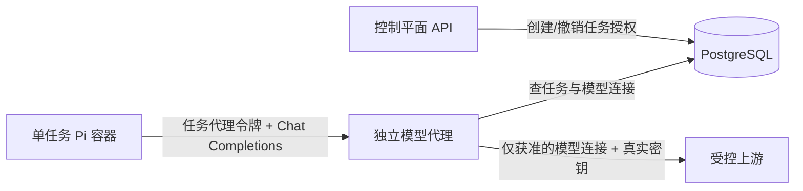

# Pi 模型代理最小设计

- 编号：ARCH-20260927-002
- 日期：2026-09-27
- 状态：上游地址和任务令牌边界已确认，出站目标策略与内部 HTTPS 传输已验收；凭据、持久授权与产品接口仍待实现
- 负责人：Codex；决策人：项目发起人
- 依据：[本地文档问答需求](../requirements/2026-09-27-001-document-qa-local-slice.md)、[模型接入决策](../questions/2026-09-27-001-model-access.md)、[本地拓扑决策](../decisions/2026-09-27-001-local-control-plane-topology.md)
- 接口草案：[模型代理 HTTP 契约](../api/2026-09-27-001-model-proxy.md)；决策：[代理安全边界](../decisions/2026-09-27-002-model-proxy-boundary.md)

## 已证实的 Pi 0.87.1 行为

- [`models.json`](../../refer/pi-main-0.87.1/packages/coding-agent/docs/models.md)可配置 `baseUrl`、`api: openai-completions`、`apiKey` 和模型 ID；代理令牌可以供 Pi 用作 API key，但会存在任务环境内，不能视作对该环境保密。
- [`openai-completions.ts`](../../refer/pi-main-0.87.1/packages/ai/src/api/openai-completions.ts)通过 OpenAI SDK 发起 `chat.completions.create`，请求包含 `stream: true`，默认请求流式 usage。请求可能包含 `store`、最大 token 数、缓存和兼容性字段，取决于模型配置。
- Pi 将上游错误文本写入 assistant 错误消息，且部分上游错误元数据可能被追加。因此代理不得把上游错误响应体、URL 或头部原样交给 Pi。流在发送响应头后中断时不能再改 HTTP 状态，须使 Pi 将本轮判为失败。
- [RPC 文档](../../refer/pi-main-0.87.1/packages/coding-agent/docs/rpc.md)规定 `prompt` 成功只表示接收，需观察 `message_end` 和 `agent_settled`；[事件文档](../../refer/pi-main-0.87.1/packages/coding-agent/docs/json.md)说明 `message_update` 为增量，`message_end.message` 为最终消息。

Pi 到固定测试代理的流式调用已由协议验收证明；真实供应商兼容性仍未验证。

## 边界与数据流

任务容器只拿到代理内部地址、模型 ID 和该任务的代理令牌。它不拿到真实上游密钥、可选择上游地址的参数、数据库连接或 Docker socket。代理是唯一解密上游密钥的应用组件；主密钥须从数据库和仓库之外注入。API 可管理密文与连接元数据，但不能通过查询接口回显明文。首轮协议验证以固定的无真实密钥测试上游代替数据库凭据读取，不得把这个测试路径当作生产配置方式。

代理只提供 Pi 所需的 `POST /v1/chat/completions` 和独立健康端点。每次请求依次验证令牌、任务状态、绑定的模型连接、JSON 体大小、`stream: true`、模型 ID 与任务配置一致，然后构造上游请求。任务请求不能覆盖上游 URL、真实认证头或代理内的连接 ID。文档问答切片禁用 Pi 工具；代理也拒绝包含 `tools` 或 `tool_choice` 的请求，作为第二道约束。Pi 的兼容性字段只在受测供应商连接上启用。

## 流式与故障

代理接收上游 SSE 并向 Pi 逐段转发，保留顺序与背压；不记录请求正文、响应正文、认证头或完整 URL。上游在发送首个字节前返回非 2xx、超时、连接失败或无效内容类型时，代理返回稳定错误码和不含上游正文的简短消息。流开始后若连接中断，代理关闭下游流，记录内部故障类别；Pi 必须把缺少正常结束标记的回答判为失败，具体事件形状由协议验证确认。取消或 Pi 断连时中止上游请求。默认不重试已开始的流，避免重复计费和重复片段；请求前重试策略留给真实连接设计。

失败观测只保留任务 ID、连接 ID、内部请求 ID、状态/故障类别、耗时和字节计数。不得在日志、RPC 事件、API 错误或测试输出中出现真实密钥或代理令牌。Pi 最终 `message_end` 也可能包含上游错误文本，因此脱敏必须发生在代理返回给 Pi 之前。

## 安全决策与验证顺序

真实上游 URL 的允许范围与任务令牌生命周期已由[决策](../decisions/2026-09-27-002-model-proxy-boundary.md)确认。出站实现应把 URL 解析为规范化 HTTPS origin，与管理员清单精确匹配；拒绝 URL 凭据、片段、查询与 IP 字面量，保留经过校验的基础路径。每次新连接解析 DNS，若任何返回地址不是公网单播地址则拒绝整个目标；连接必须固定到已验证地址，TLS 仍以原主机名校验证书，不跟随 3xx 重定向。当前本地单人规模可先不用连接复用，避免缓存地址绕过重新校验；是否允许特殊供应商端口由管理员清单的精确 origin 决定。这些是落实已确认安全边界的保守技术选择，若供应商需要例外再单独设计。

任务令牌可采用 256 位随机值，数据库保存不可逆摘要与任务 ID、模型连接 ID、有效期和撤销时间；停止/删除/切换连接的事务需先撤销旧授权，恢复后重新配置任务容器的新令牌。具体有效期、续期、密钥注入和管理入口属于后续详细设计。已完成的首个独立任务只实现出站目标策略，不接触真实密钥或数据库。

### 出站目标校验的首个实现边界

内部策略函数接收模型连接的 base URL、管理员批准的 origin 集合和 DNS 解析器，返回规范化 URL、原主机名及选定的公网 IP/地址族，或返回不含输入目标的拒绝错误。origin 精确比较须在 URL 解析与规范化之后进行，不能用字符串前缀或域名后缀匹配。批准项本身也必须是无路径、查询、片段和用户信息的 HTTPS origin。

采用已有依赖树中使用的 `ipaddr.js` 2.5.0（MIT）作为直接依赖来分类 IPv4、IPv6 及 IPv4 映射地址；只有公网单播地址可通过。DNS 返回空集、查询失败、地址格式不合法，或任何一个结果为非公网时均拒绝。选定地址供 HTTPS 传输使用；传输不得再次独立解析 DNS，必须固定连接该地址，并以原主机名执行 TLS SNI 和证书校验。已验收的策略模块不发起网络请求，也不宣称单靠目标判定已经阻断 SSRF。内部传输的落实见[详细设计](2026-09-27-003-fixed-ip-https-transport.md)与验收，尚未接入产品代理。

固定 Docker 网络内的无凭据协议验证已覆盖正常 SSE、无效/跨任务令牌、上游非 2xx、流中断与假敏感文本脱敏。Pi 0.87.1 的独立临时容器产生了预期的 `message_update`、`message_end` 和 `agent_settled`。这只证明固定配置下的协议适配，不证明真实供应商兼容、生产网络隔离、持久化和多用户授权。
